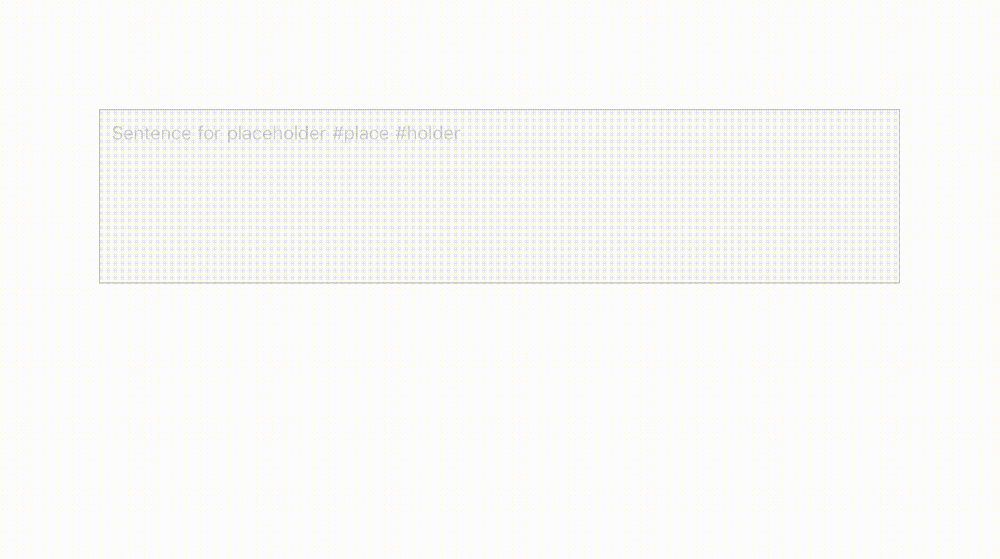
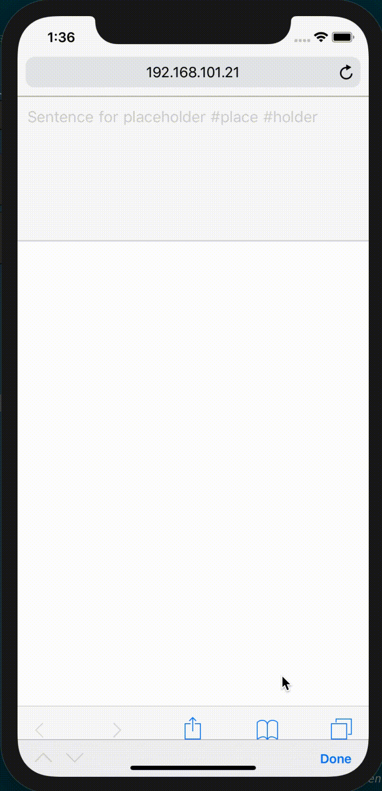

# Highlight hashtags on Vue.js module

## Features
* Highlight hastags in textarea
* Resize textarea automatically
* Notify inputting hashtag in realtime
* Support japanese.

| Desktop | Mobile | 
| --- | --- | 
| |  |


## Getting started
### Download
Via npm

```
$ npm install vue-hashtag-textarea --save
```

### Usage
### ES6 modules
```
import VueHashtagTextarea from 'vue-hashtag-textarea';
```

### Vue file
```
import VueHashtagTextarea from '/path/to/vue-hashtag-textarea.vue';
```

## Hello world
```js
<template>
  <div class="container">
    <vue-hashtag-textarea :option=option v-on:onChangeHashtag="onChangeHashtag"
    v-on:onSelectHashtag="onSelectHashtag" />
  <div>  
</template>

<script>
  import VueHashtagTextarea from 'vue-hashtag-textarea'
  export default {
    data() {
      return {
        option: {
          textColor: 'black',
          hashtagBackgroundColor: '#ffff00',
          hashtagColor: '#ff0000',
        }
      }
    },
    components: {
      VueHashtagTextarea,
    },
    mounted() {},
    methods: {
      onChangeHashtag(obj) {
        // NOTE: Everytime hashtags is inputed in vue-hashtag-textarea,
        //       values will be callbacked in this scope
      },
      onSelecthashtag(content) {
        // TODO:
      }
    },
  }
</script>
```

## Options
| Options | Description | Default |
|:--|:--|:--|
|textColor|ordinary text color|black|
|font|wave height|14px "Noto Sans Japanese", sans-serif|
|hashtagBackgroundColor|background color on hashtag|transparent|
|hashtagColor|hashtag color|#ff0000|
|placeholder|placeholder on empty|Sentence for placeholder #place #holder|

## Callback Functions

### **onChangeHashtag(obj)**

##### Argument

* obj : Object

| Values | Type | Description |
|:--|:--|:--|
|target|String|focusing hashtag|
|hashtags|Array|hashtag list in the sentence|

##### Description
Everytime hashtags is inputed in vue-hashtag-textarea,
values including whole hashtags and current focusing hashtag will be notified by this callback function. If caret is not at hashtag, this callback doesn't be fired.

### **onSelectHashtag(content)**

##### Argument

* content : String

##### Description
When hashtag element is selected, this callback function will be fired with the specific hashtag.

## Browser support

### Desktop
| Chrome | Safari | IE / Edge | Firefox | Opera |
| --- | --- | --- | --- | --- |
| 72+ | 12+ | ? | 65+ | ? |

### Mobile
| Android webview | Chrome for Android | Safari on iOS | Edge Mobile | Firefox for Android | Opera for Android | Samsung Internet |
| --- | --- | --- | --- | --- | --- | --- |
| ? | ? | 12+ | ? | ? | ? | ? |


##### NOTE
<small>If debugging iOS devices on chrome dev tools, the layout will be failed. In that case, recommend to use Safari browser instead.</small>


## License
**[MIT](https://github.com/mitsuyacider/vue-hashtag-textarea/blob/master/LICENSE.txt)**